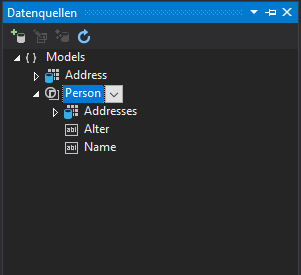
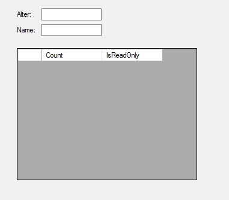
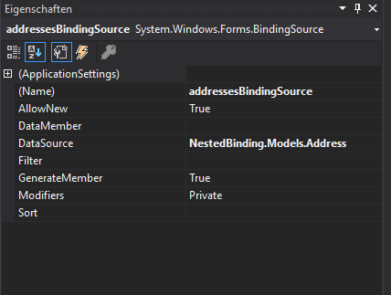
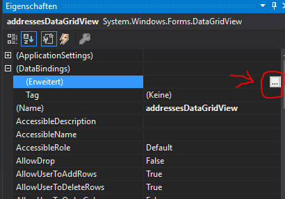
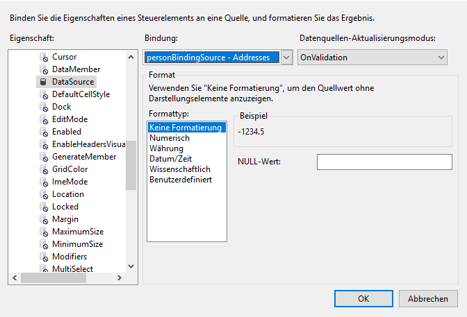
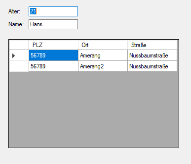

# Nested Binding in Visual Studio 2017

Lets say you have two models:

```C#
    class Person
    {
        public string Name { get; set; }
        public int Alter { get; set; }

        public ICollection<Address> Addresses { get; set; }
    }

    class Address
    {
        public int PLZ { get; set; }
        public string Ort { get; set; }
        public string Straße { get; set; }
    }
```

First, add the datasource models in VS. Then drop the Person Datasource (as Details) into the View. 



You will notice that nested properties were not added into the view.


You will have to add the addresses Datasource manually to the view.



You will notice that the datagrid is not mapped correctly yet.
In order to fix this you will have to do two steps. First set the datasource of the bindingsource to Models.Address.



In order to create a binding between the datagrid and the personbindingsource.Adress Property you will have to set it manually in the binding menu of the datagrid:



Here set the Datasource to personBindingSource.Addresses and click ok



### Result

In order to test the binding you can enter the following Code within the views constructor

```C#
public Form1()
{
    InitializeComponent();

    personBindingSource.DataSource = new Person
    {
        Alter = 21,
        Name = "Hans",
        Addresses = new List<Address>
        {
            new Address { Ort = "Amerang", PLZ = 56789, Straße = "Nussbaumstraße" },
            new Address { Ort = "Amerang2", PLZ = 56789, Straße = "Nussbaumstraße" }
        }
    };

    addressesBindingSource.DataSource = personBindingSource;
    addressesBindingSource.DataMember = nameof(Person.Addresses);
}
```

After that you can validate the result and should see something like that:



As you can see the binding works as expected.
Nested databinding may not be as intuitive as one might expect but it works nonetheless.